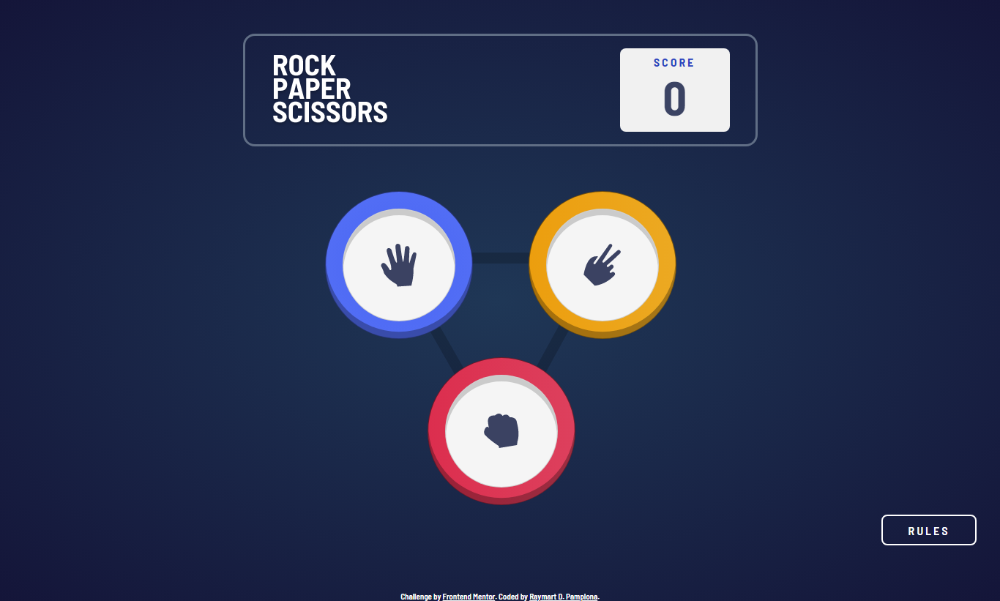

# Frontend Mentor - Rock, Paper, Scissors solution

This is a solution to the [Rock, Paper, Scissors challenge on Frontend Mentor](https://www.frontendmentor.io/challenges/rock-paper-scissors-game-pTgwgvgH). Frontend Mentor challenges help you improve your coding skills by building realistic projects. 

## Table of contents

- [Overview](#overview)
  - [The challenge](#the-challenge)
  - [Screenshot](#screenshot)
  - [Links](#links)
- [My process](#my-process)
  - [Built with](#built-with)
  - [What I learned](#what-i-learned)
  - [Continued development](#continued-development)
  - [Useful resources](#useful-resources)
- [Author](#author)
- [Acknowledgments](#acknowledgments)

### The challenge

Users should be able to:

- View the optimal layout for the site depending on their device's screen size
- See hover states for all interactive elements on the page

### Screenshot

I did not include the mobile screenshots since it is very long ahahaa

### Links

Live Site URL: [Live site of the challenge hosted here](https://pikapikamart.github.io/rock-paper-scissor/)

## My process

Hello, this is my 13th challenge here in FrontEndMentor and this challenge was super fun. The logic is easy but making the UI work is troublesome, since I only limited myself with just few elements, and I reuse them, that is why I have to make sure that every point in javascript will add transition when I needed and removing it as well. Overall it is really fun and I hope you enjoyed it. But the first draft of this was funny since I added some animations that will make you crazy since a hand will get the buttons and you won't be able to click it unless you irritate the hand hahaha. I will apply that when I finished the spock lizards and that one 

### Built with

- Semantic HTML5 markup
- CSS custom properties
- FlexBox
- Javascript
- Sass preprocessor

I said that I won't use any frameworks and build it from scratch to be more exciting and challenging

### What I learned

This challenge taught me that when limiting elements, you have to make sure that every point will apply in your javascript. Since you are manipulating only few element so you have to be very carefull, add functions and remove functions at certain times.

### Continued development

I want to focus more on creating more complex designs and also designing things on my own time

## Author

- Website - Well I haven't made my profile portfolio, gonna make it sooon when I know a lot of stuffs
- Frontend Mentor - [@pikamart](https://www.frontendmentor.io/profile/pikamart)
- Twitter - [@RaymartPamplona](https://twitter.com/RaymartPamplona)